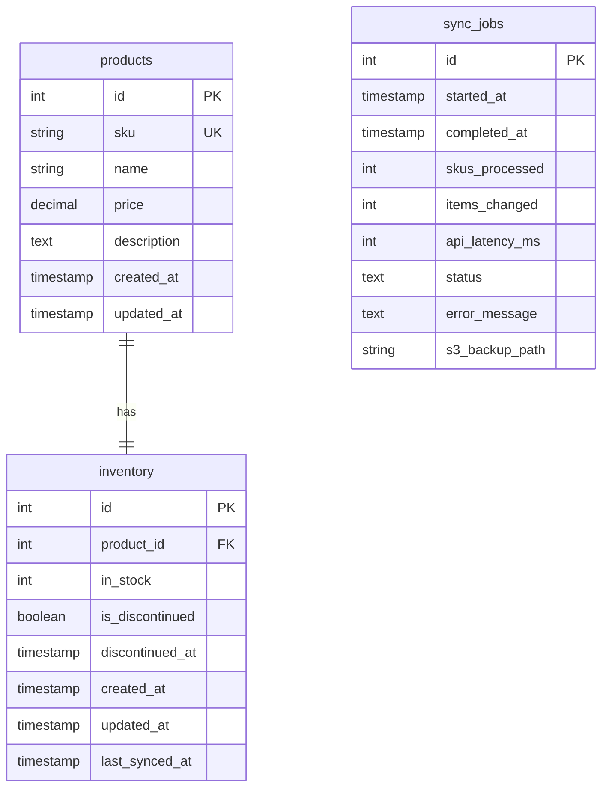
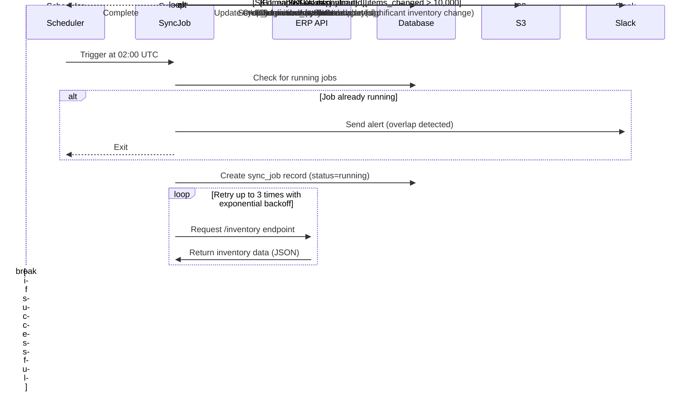

# Technical Specification: ERP to E-commerce Inventory Sync

## Overview

This specification outlines the development of an automated process to synchronize inventory stock counts from our Enterprise Resource Planning (ERP) system to our e-commerce database on a nightly basis. This ensures that our online store accurately reflects current inventory levels.

## Business Context

### Problem Statement

Our e-commerce platform requires accurate and up-to-date inventory information to prevent overselling and improve customer experience. Currently, inventory data between our ERP system and e-commerce platform is not automatically synchronized, leading to potential discrepancies between actual inventory and what's displayed on the website.

### Goals

1. Maintain accurate inventory levels on the e-commerce platform
2. Eliminate manual inventory updates
3. Reduce the risk of overselling products
4. Provide audit trail for inventory changes
5. Enable operations team to monitor significant inventory adjustments

### Non-goals

1. Real-time inventory synchronization (daily sync is sufficient)
2. Bidirectional synchronization (changes in e-commerce will not update ERP)
3. Full product data synchronization (only inventory counts are in scope)

## Technical Design

### System Architecture

The inventory synchronization will be implemented as a scheduled job that:
1. Retrieves inventory data from the ERP REST API
2. Processes and updates the e-commerce database
3. Archives raw data in S3
4. Reports metrics and sends alerts when necessary

### ER Diagram



### Database Changes

```sql
-- Create inventory table if it doesn't exist
CREATE TABLE IF NOT EXISTS inventory (
    id SERIAL PRIMARY KEY,
    product_id INTEGER NOT NULL REFERENCES products(id),
    in_stock INTEGER NOT NULL DEFAULT 0,
    is_discontinued BOOLEAN NOT NULL DEFAULT FALSE,
    discontinued_at TIMESTAMP,
    created_at TIMESTAMP NOT NULL DEFAULT CURRENT_TIMESTAMP,
    updated_at TIMESTAMP NOT NULL DEFAULT CURRENT_TIMESTAMP,
    last_synced_at TIMESTAMP NOT NULL DEFAULT CURRENT_TIMESTAMP,
    CONSTRAINT unique_product_inventory UNIQUE (product_id)
);

-- Create sync_jobs table to track sync operations
CREATE TABLE IF NOT EXISTS sync_jobs (
    id SERIAL PRIMARY KEY,
    started_at TIMESTAMP NOT NULL DEFAULT CURRENT_TIMESTAMP,
    completed_at TIMESTAMP,
    skus_processed INTEGER DEFAULT 0,
    items_changed INTEGER DEFAULT 0,
    api_latency_ms INTEGER DEFAULT 0,
    status TEXT NOT NULL, -- 'running', 'completed', 'failed'
    error_message TEXT,
    s3_backup_path TEXT
);

-- Add index to improve performance
CREATE INDEX idx_inventory_product_id ON inventory(product_id);
CREATE INDEX idx_products_sku ON products(sku);
```

### Sequence Diagram



## Implementation Details

### Job Scheduling

The job will be scheduled to run at 02:00 UTC daily using a cron expression:

```
0 2 * * * /path/to/inventory-sync-script
```

### API Integration

The sync process will interact with the ERP system's REST API:

- Endpoint: `/inventory`
- Method: GET
- Authentication: Bearer token
- Expected response format: JSON array of objects with `sku` and `qty` properties

Example response:
```json
[
  {"sku": "ABC-123", "qty": 45},
  {"sku": "XYZ-789", "qty": 12},
  {"sku": "DEF-456", "qty": 0}
]
```

### Error Handling

1. API connection failures: Retry up to 3 times with exponential backoff (initial wait 5s, then 15s, then 45s)
2. Data validation: Log invalid records but continue processing valid ones
3. Database errors: Roll back transaction on critical errors

### Concurrency Control

To prevent overlapping executions:
1. Check for any running jobs (`status = 'running'`) before starting
2. Use row-level locking during database updates
3. Implement a job timeout of 30 minutes

### S3 Storage

Raw API payloads will be stored in S3 with the following structure:
- Bucket: `company-erp-backups`
- Path: `/inventory-sync/YYYY-MM-DD/inventory_YYYYMMDD_HHMMSS.json`
- Lifecycle policy: Delete objects older than 30 days

### Monitoring and Alerting

1. Log metrics for each job:
   - Total SKUs processed
   - Number of inventory changes made
   - API latency
   - Job duration
   
2. Send Slack alerts to `#ops-inventory` when:
   - Job fails
   - More than 10,000 items changed in a single sync
   - Job exceeds 15 minutes runtime

## Testing Strategy

### Unit Tests

1. Test API response parsing
2. Test database update logic
3. Test error handling and retry mechanism

### Integration Tests

1. Test with mock ERP API
2. Verify database changes
3. Verify S3 storage functionality

### Performance Tests

1. Test with 50k SKUs dataset
2. Verify completion within 15 minutes
3. Measure and optimize database operations

## Deployment and Rollout

### Prerequisites

1. S3 bucket created with appropriate IAM policies
2. Database schema updates applied
3. Slack integration configured

### Deployment Steps

1. Deploy the sync script to the application server
2. Set up the cron job
3. Run an initial test execution with logging enabled

### Rollback Plan

1. Disable the cron job
2. Restore database from backup if necessary

## Open Questions and Future Improvements

1. **Discontinued Products**: Current plan is to set `discontinued_at` timestamp when a product is flagged as discontinued in the ERP. Need to confirm if additional steps are required.

2. **Incremental Sync**: Future enhancement to implement partial syncs using a "modifiedSince" parameter to reduce API load and processing time.

3. **Performance Optimization**: Consider batching database operations or parallel processing if the 15-minute SLA becomes challenging with increasing product catalog size.

4. **Notifications**: Should business users (beyond operations team) be notified of significant inventory changes?

## Timeline and Resources

### Estimated Timeline

- Development: 3 days
- Testing: 2 days
- Deployment: 1 day
- Total: 1 week

### Required Resources

- 1 Backend developer
- Access to ERP system documentation and test environment
- Access to e-commerce database and S3
