## 🧩 Feature: Password Reset (Email Token Flow)

Allow users who have forgotten their password to request a reset link and set a new password with a time-limited, single-use token.

---

## 1️⃣ API DESIGN  

### 🔗 Endpoint #1 – Request Reset Link
| Key | Value |
|-----|-------|
| **Path** | `/api/v1/auth/password-reset/request` |
| **Method** | `POST` |
| **Auth** | none |
| **Description** | Generates a reset token and emails the link to the user |
| **Idempotency-Key** | No |

#### 1.1 Request
```json
{ "email": "user@example.com" }
```

| Field | Type | Required | Validation | Description |
|-------|------|----------|------------|-------------|
| email | string | Yes | RFC-5322 | User's account email |

#### 1.2 Success (200)
```json
{
  "success": true,
  "message": "If an account exists with this email, a password reset link has been sent"
}
```

#### 1.3 Error Responses
| Status | Code | Message | Condition |
|--------|------|---------|-----------|
| 400 | INVALID_EMAIL | Please provide a valid email address | Email format invalid |
| 429 | TOO_MANY_REQUESTS | Too many reset attempts, try again later | Rate limit exceeded |
| 500 | SERVER_ERROR | An unexpected error occurred | Server-side fault |

### 🔗 Endpoint #2 – Validate Token
| Key | Value |
|-----|-------|
| **Path** | `/api/v1/auth/password-reset/validate` |
| **Method** | `GET` |
| **Auth** | none |
| **Description** | Checks whether a reset token is valid and unexpired |
| **Idempotency-Key** | No |

#### 2.1 Query Parameter
| Parameter | Type | Required | Description |
|-----------|------|----------|-------------|
| token | string | Yes | Password-reset token |

Example: `GET /password-reset/validate?token=abcd-uuid`

#### 2.2 Success (200)
```json
{ "valid": true, "email": "user@example.com" }
```

#### 2.3 Error Responses
| Status | Code | Message | Condition |
|--------|------|---------|-----------|
| 400 | MISSING_TOKEN | Reset token is required | No token param |
| 400 | INVALID_TOKEN | Reset token is invalid | Token not found |
| 400 | EXPIRED_TOKEN | Reset token has expired | Token expired |
| 500 | SERVER_ERROR | Unexpected error | Server-side fault |

### 🔗 Endpoint #3 – Complete Reset
| Key | Value |
|-----|-------|
| **Path** | `/api/v1/auth/password-reset/complete` |
| **Method** | `POST` |
| **Auth** | none |
| **Description** | Resets the user's password using a valid token |
| **Idempotency-Key** | No |

#### 3.1 Request
```json
{
  "token": "abcd-uuid-token",
  "password": "NewSecurePassword123!",
  "confirmPassword": "NewSecurePassword123!"
}
```

| Field | Type | Required | Description |
|-------|------|----------|-------------|
| token | string | Yes | Reset token |
| password | string | Yes | New password (must meet policy) |
| confirmPassword | string | Yes | Must match password |

#### 3.2 Success (200)
```json
{ "success": true, "message": "Password has been reset successfully" }
```

#### 3.3 Error Responses
| Status | Code | Message | Condition |
|--------|------|---------|-----------|
| 400 | PASSWORDS_DONT_MATCH | Passwords do not match | Mismatch |
| 400 | PASSWORD_TOO_WEAK | Password does not meet requirements | Fails policy |
| 400 | MISSING_TOKEN | Token is required | Field missing |
| 400 | INVALID_TOKEN | Token invalid | Not found |
| 400 | EXPIRED_TOKEN | Token expired | expires_at < now |
| 409 | TOKEN_ALREADY_USED | Token already used | used = true |
| 500 | SERVER_ERROR | Unexpected error | Server-side fault |

## 3️⃣ DATABASE SCHEMA
```sql
CREATE TABLE password_reset_tokens (
  id          SERIAL PRIMARY KEY,
  user_id     INTEGER  NOT NULL,
  token       VARCHAR(64) NOT NULL UNIQUE,
  email       VARCHAR(255) NOT NULL,
  expires_at  TIMESTAMP    NOT NULL,
  created_at  TIMESTAMP    NOT NULL DEFAULT CURRENT_TIMESTAMP,
  used_at     TIMESTAMP    NULL,
  CONSTRAINT fk_user FOREIGN KEY (user_id)
            REFERENCES users(id) ON DELETE CASCADE
);

CREATE INDEX idx_reset_tokens_token  ON password_reset_tokens(token);
CREATE INDEX idx_reset_tokens_email  ON password_reset_tokens(email);
```

## 🗺️ ER Diagram


## 🔄 Sequence Diagram

```mermaid
sequenceDiagram
    participant Client
    participant API
    participant DB
    participant EmailSvc as EmailService

    %% Request flow
    Client  ->> API : POST /password-reset/request
    API     ->> DB  : INSERT password_reset_tokens
    API     ->> EmailSvc : sendResetEmail(token)
    API    -->> Client : 200 OK

    %% Validate flow
    Client  ->> API : GET /password-reset/validate?token=xyz
    API     ->> DB  : SELECT token
    API    -->> Client : 200 / 400

    %% Complete flow
    Client  ->> API : POST /password-reset/complete
    API     ->> DB  : UPDATE users SET password_hash = …
    API     ->> DB  : UPDATE password_reset_tokens SET used_at = NOW()
    API    -->> Client : 200 OK
```


## 5️⃣ EDGE CASES & DISCUSSION POINTS
- Silent-fail for unknown email → always return 200 to prevent user enumeration.
- Multiple requests → newest token invalidates prior ones.
- Hash tokens in DB; never store plaintext.
- Invalidate sessions after successful reset.
- Rate-limit /request (≤ 5 per hour per email).
- Audit-log all reset attempts for security.

## 6️⃣ REFERENCES
- PM Spec: https://notion.so/...
- UX Flow: https://figma.com/... 