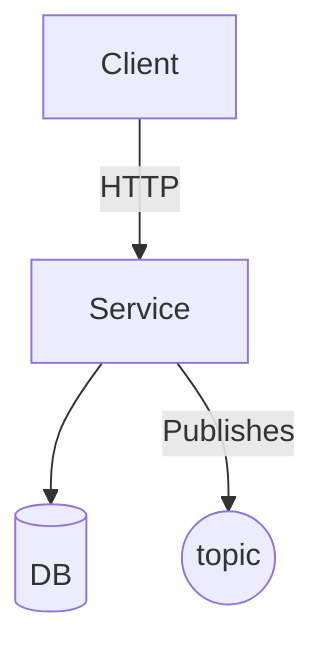
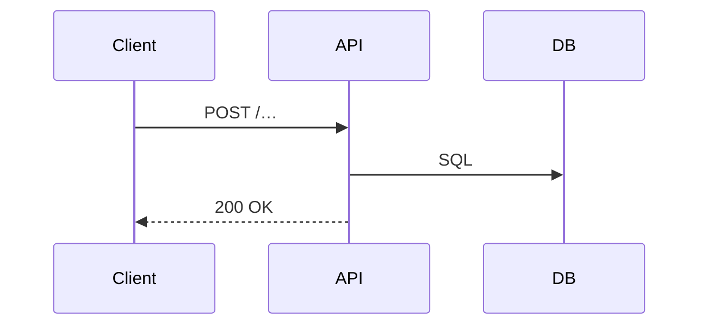

<!-- =============================================================
  BACKEND FEATURE SPEC TEMPLATE  •  v2.0  (May 2025)
  Copy → rename to docs/api/<feature>.md, then replace <PLACEHOLDERS>.
  Sections marked <!-- optional --> may be deleted if not relevant.
============================================================= -->

## 🧩 Technical Specification: <Feature Name>

### Overview  (short)
<One-sentence summary of what the feature does and for whom.>

### Business Context  <!-- optional -->
- **Problem Statement** <Why this matters to the business>
- **Goals** <…>    **Non-Goals** <…>

---

## 1  System Architecture  <!-- optional -->



| Component | Responsibility | Notes |
|-----------|----------------|-------|
| <Service> | <What it does> | <Language / framework> |
| <DB>      | <Main tables>  | <RDS / Dynamo / …> |

## 2  API Design <!-- duplicate Endpoint block for each route -->

### 🔗 Endpoint

| Key | Value |
|-----|-------|
| Path | <HTTP path> |
| Method | `GET` |
| Auth | `Bearer JWT` |
| Description | <What this endpoint does> |
| Idempotency-Key | Yes |

#### 2.1 Request

```json
{ "<field>": "<example>" }
```

| Field | Type | Required | Validation / Format | Description |
|-------|------|----------|---------------------|-------------|
|       |      |          |                     |             |

#### 2.2 Success (200)

```json
{ "data": { … }, "meta": { … } }
```

#### 2.3 Error Responses

| Status | Code | Message | Condition |
|--------|------|---------|-----------|
| 400 | <CODE> | <Msg> | <When> |

## 4 Database Design

### 4.1 SQL DDL (or ORM)

```sql
-- CREATE / ALTER TABLE statements
```

### 4.2 ER Diagram

```mermaid
erDiagram
  TABLE_A ||--o{ TABLE_B : FK
  TABLE_A { id UUID PK … }
  TABLE_B { id UUID PK table_a_id UUID FK … }
```

## 5 Request Flow Diagram

