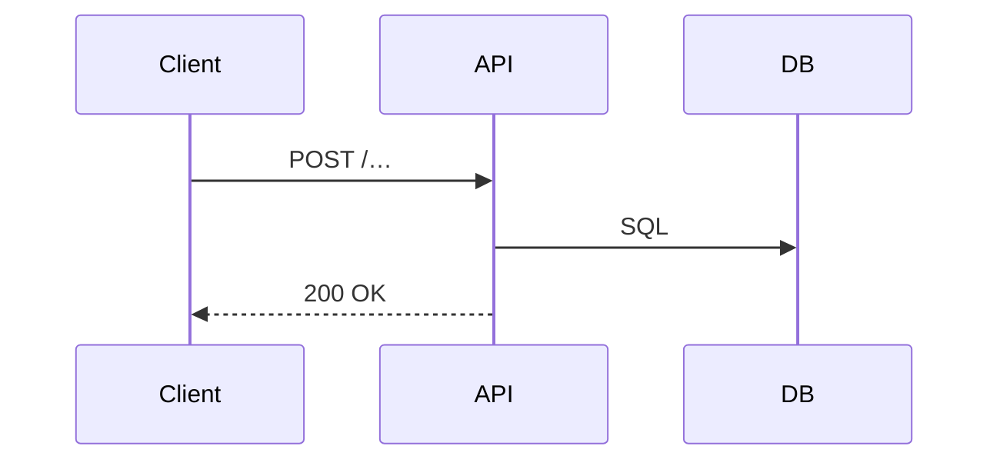

<!-- =========================================================
  BACKEND API & DB SPEC  •  CORE TEMPLATE (no extras)
  Copy → rename to docs/api/<feature>.md
  Replace every <PLACEHOLDER>.
========================================================= -->

## 🧩 Feature: <Feature Name>
<One-sentence summary of what the feature does.>

---

## 1 API DESIGN
<!-- Duplicate the Endpoint block for every route that changes or is added -->

### 🔗 Endpoint
| Key | Value |
|-----|-------|
| **Path** | `<HTTP path>` |
| **Method** | `GET | POST | PUT | PATCH | DELETE` |
| **Auth** | `Bearer JWT | Api-Key | none` |
| **Description** | <Short action description> |

#### Request
```json
{ "<field>": "<example>" }


#### 1.1 Request

```json
{ "<field>": "<example>" }
```

| Field | Type | Required | Validation / Format | Description |
|-------|------|----------|---------------------|-------------|
|       |      |          |                     |             |

#### 1.2 Success (200)

```json
{ "data": { … }, "meta": { … } }
```

#### 1.3 Error Responses

| Status | Code | Message | Condition |
|--------|------|---------|-----------|
| 400 | <CODE> | <Msg> | <When> |

## 2 Database SCHEMA

### 2.1 ER Diagram

```mermaid
erDiagram
  TABLE_A ||--o{ TABLE_B : FK
  TABLE_A { id UUID PK … }
  TABLE_B { id UUID PK table_a_id UUID FK … }
```

## 3 Request Flow Diagram

