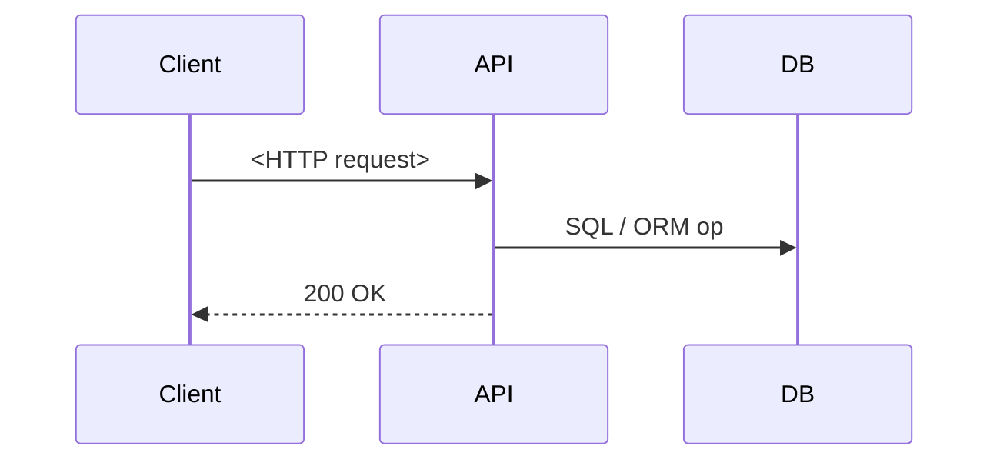

<-- BACKEND API & DB SPEC TEMPLATE • v1.0 -->
## 🧩 Feature: <Feature Name>

<One-sentence business goal or user story>

---

### 🔗 Endpoint
| Key | Value |
|-----|-------|
| **Path** | `<HTTP path>` |
| **Method** | `GET | POST | PUT | PATCH | DELETE` |
| **Auth** | `Bearer JWT | Api-Key | none` |
| **Description** | <What this endpoint does> |

#### Request
```json
{ "<field>": "<example>" }

#### Response
##### 1.2 Success (200)
```json
{
  "data": { /* ... */ },
  "meta": { /* ... */ }
}
```

##### 1.3 Error Responses
| Status | Code | Message | Condition |
|--------|------|---------|-----------|
| 400 | `<CODE>` | `<Msg>` | `<When>` |

---

## 2️⃣ ASYNC EVENTS (optional)
| Event name | Trigger | Payload JSON | Destination |
|------------|---------|--------------|-------------|
| `<event>` | `<when>` | `{ ... }` | Kafka topic / SNS / etc. |

## 3️⃣ DATABASE SCHEMA
### 3.1 SQL DDL / ORM
```sql
-- CREATE / ALTER TABLE statements go here
```

### 3.2 ER Diagram (Mermaid)
```mermaid
erDiagram
  TABLE_A ||--o{ TABLE_B : FK
  TABLE_A {
    UUID id PK
    /* ... */
  }
  TABLE_B {
    UUID id PK
    UUID table_a_id FK
    /* ... */
  }
```

## 4️⃣ REQUEST FLOW DIAGRAM


## 5️⃣ EDGE CASES & DISCUSSION POINTS
- `<Case & mitigation>`
- `<Case & mitigation>`

## 6️⃣ NON-FUNCTIONAL REQUIREMENTS
| Category | Requirement |
|----------|-------------|
| Performance | `<p99 latency ≤ 300 ms>` |
| Observability | `Trace + metric name` |
| Security | `TLS 1.2+, input sanitization` |
| Compliance | `GDPR tagging for PII fields` |

## 7️⃣ DEPLOYMENT / MIGRATION STEPS
1. Run migration `<file.sql>` on staging & prod.
2. Deploy service version `<tag>`.

## 8️⃣ REFERENCES
- PM Spec: `<link>`
- UX Flow: `<Figma link>`
- ADR: `<doc link>`

## 9️⃣ SAMPLES
### 2.2 `samples/password-reset.md` – full example  
*(paste the re-formatted password-reset spec from earlier response)*

### 2.3 `README.md`

```markdown
# Backend API & DB Specs

This repo hosts the **canonical template** (`template.md`) and reference
examples (`samples/`) for all backend feature specifications.

## How to use

1. **Copy** `template.md` into your feature branch (any service repo) or into
   Claude's GitHub picker.
2. **Fill** the placeholders manually *or* let Claude/Cursor auto-fill by also
   selecting relevant code files and past specs.
3. **Save** the completed spec as `docs/api/<feature>.md` in the service repo.
4. Open a PR – reviewers confirm diagrams render & SQL lint passes.

> See `samples/password-reset.md` for a fully-populated example.
```

