```mermaid
sequenceDiagram
  participant Client
  participant API
  participant DB
  Client ->> API : POST /…
  API    ->> DB  : SQL
  API   -->> Client : 200 OK
```

<!-- =============================================================
  BACKEND FEATURE SPEC TEMPLATE  •  v2.0  (May 2025)
  Copy → rename to docs/api/<feature>.md, then replace <PLACEHOLDERS>.
  Sections marked <!-- optional --> may be deleted if not relevant.
============================================================= -->

## 🧩 Technical Specification: <Feature Name>

### Overview  (short)
<One-sentence summary of what the feature does and for whom.>

### Business Context  <!-- optional -->
- **Problem Statement** <Why this matters to the business>
- **Goals** <…>    **Non-Goals** <…>

---

## 1  System Architecture  <!-- optional -->


| Component | Responsibility | Notes |
|-----------|----------------|-------|
| <Service> | <What it does> | <Language / framework> |
| <DB>      | <Main tables>  | <RDS / Dynamo / …> |

## 2  API Design <!-- duplicate Endpoint block for each route -->

### 🔗 Endpoint

| Key | Value |
|-----|-------|
| Path | <HTTP path> |
| Method | `GET` |
| Auth | `Bearer JWT` |
| Description | <What this endpoint does> |
| Idempotency-Key | Yes |

#### 2.1 Request

```json
{ "<field>": "<example>" }
```

| Field | Type | Required | Validation / Format | Description |
|-------|------|----------|---------------------|-------------|
|       |      |          |                     |             |

#### 2.2 Success (200)

```json
{ "data": { … }, "meta": { … } }
```

#### 2.3 Error Responses

| Status | Code | Message | Condition |
|--------|------|---------|-----------|
| 400 | <CODE> | <Msg> | <When> |

## 3 Async Events (Kafka / SNS / Webhooks) <!-- optional -->
Include this section only if the feature emits events across
service boundaries.
Skip entirely if changes are local to one service or deemed as unnecessary.

| Event name | Trigger | Payload JSON | Destination / Topic | Partition Key |
|------------|---------|--------------|---------------------|---------------|
| <entity.updated> | After successful 200 | { "id": "uuid", … } | inventory.updates | id |

## 4 Database Design

### 4.1 SQL DDL (or ORM)

```sql
-- CREATE / ALTER TABLE statements
```

### 4.2 ER Diagram

```mermaid
erDiagram
  TABLE_A ||--o{ TABLE_B : FK
  TABLE_A { id UUID PK … }
  TABLE_B { id UUID PK table_a_id UUID FK … }
```

## 5 Request Flow Diagram



## 6 Implementation Details <!-- optional -->

| Area | Decision |
|------|----------|
| Scheduling | <cron 0 2 * * *> |
| External API | ERP /inventory (Bearer token) |
| Error Handling | Retry 3× with exponential back-off |
| Concurrency | Check running job row; use row-level locks |
| Storage | Raw payload → S3 bucket/path (30-day TTL) |

## 7 Monitoring & Alerting <!-- optional -->

| Metric / Alert | Threshold | Channel |
|----------------|-----------|---------|
| items_changed | > 10 000 | #ops-inventory |
| Job duration | > 15 min | PagerDuty |

## 8 Edge Cases & Discussion Points

<e.g. silent-fail for unknown email addresses>

<e.g. handling discontinued SKUs>

## 9 Testing Strategy <!-- optional -->

| Layer | What to test |
|-------|--------------|
| Unit | API response parsing; DB update logic |
| Integration | Mock upstream API; verify S3 upload |
| Performance | 50 k SKUs ≤ 15 min |

## 10 Deployment / Migration Steps

Apply SQL migration <file.sql>.

Deploy service version <tag>.

Enable cron job in production.


## 11 References

PM Spec: <Notion URL>

Figma Flow: <Figma URL>

ADR: <doc link> 